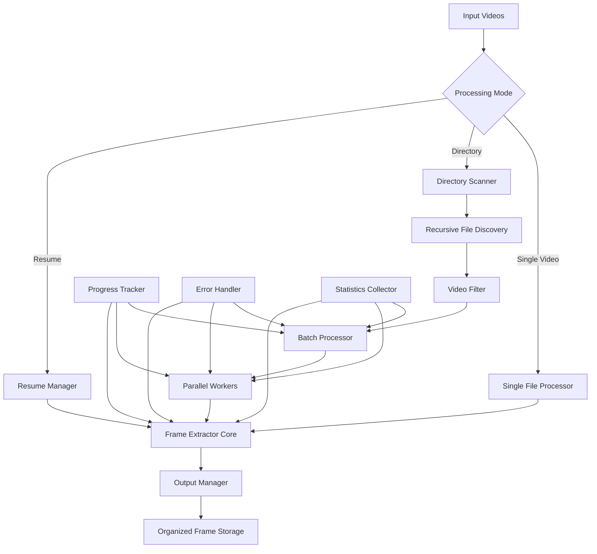

# Video Processing Refactoring Plan

## Overview
Split the current monolithic YouTube frame extractor into two focused, reusable components with enhanced batch processing capabilities.

## 🎯 Objectives
1. **Separate concerns**: YouTube downloading vs. frame extraction
2. **Enhanced batch processing**: Robust directory traversal and parallel processing
3. **Universal compatibility**: Work with any video format, not just YouTube downloads
4. **Step-based extraction**: Default step=1 (every frame), configurable intervals
5. **Production-ready**: Resume capability, error handling, progress tracking

## 📁 New File Structure
```
utils/
├── youtube/
│   ├── download_videos.py          # New: YouTube video downloader
│   └── frame_extract.py            # Current (to be archived)
└── video/
    ├── video_utils.py              # Existing utilities (enhanced)
    ├── extract_frames.py           # New: Universal frame extractor
    └── downsample.py               # Existing
```

## 🔧 Component 1: YouTube Video Downloader
**File:** `utils/youtube/download_videos.py`

### Core Features
- Download videos from YouTube URLs with quality selection
- Support for cookies authentication
- Metadata extraction and storage
- Batch processing of URL lists from files
- Progress tracking and comprehensive error handling
- Duplicate detection and skipping
- Statistics and detailed reporting

### Key Classes
```python
class YouTubeDownloader:
    def __init__(self, output_dir="./videos", max_workers=4)
    def download_video(self, url, quality="1080p", cookies=None)
    def download_urls(self, urls, quality="720p", cookies=None)
    def get_stats(self)
    def cleanup_failed_downloads(self)
```

### CLI Interface
```bash
# Single/multiple URLs
python download_videos.py --urls URL1 URL2 --quality 720p --output ./videos

# From file with parallel processing
python download_videos.py --file urls.txt --quality 1080p --cookies cookies.txt --workers 2

# With cleanup and statistics
python download_videos.py --file urls.txt --cleanup --stats
```

## 🔧 Component 2: Universal Frame Extractor (Enhanced Batch Processing)
**File:** `utils/video/extract_frames.py`

### Enhanced Batch Processing Features

#### 🗂️ Directory Processing
- **Recursive traversal**: Process entire directory trees automatically
- **Smart filtering**: Auto-detect video files using `video_utils.is_video_file()`
- **Organized output**: Create subdirectories mirroring input structure
- **Resume capability**: Skip already processed videos/frames
- **Progress tracking**: Multi-level progress bars (directories → videos → frames)

#### ⚡ Parallel Processing
- **Concurrent video processing**: Process multiple videos simultaneously
- **Configurable workers**: Adjust parallelism based on system resources
- **Memory management**: Process videos in batches to avoid memory overload
- **Error isolation**: One failed video doesn't stop batch processing

#### 📊 Advanced Frame Extraction
- **Step parameter**: Default=1 (every frame), step=N (every Nth frame)
- **Time-based extraction**: Extract frames between specific timestamps
- **Smart naming**: Include video name, timestamp, frame number
- **Format options**: JPG, PNG output formats
- **Quality control**: Configurable compression settings

### Key Classes
```python
class FrameExtractor:
    def __init__(self, output_dir="./frames", max_workers=4, create_subdirs=True)
    
    # Single video processing
    def extract_frames(self, video_path, step=1, max_frames=None, start_time=0, end_time=None)
    
    # Batch processing - ENHANCED
    def extract_from_directory(self, video_dir, step=1, max_frames=None, recursive=True)
    def extract_from_videos(self, video_paths, step=1, max_frames=None)
    
    # Utility methods
    def get_video_info(self, video_path)
    def resume_extraction(self, video_dir)
    def get_extraction_stats(self)
    def cleanup_incomplete_frames(self)
```

### Enhanced CLI Interface
```bash
# Process single video
python extract_frames.py --video video.mp4 --step 1 --output ./frames

# Process entire directory (recursive)
python extract_frames.py --directory ./videos --step 30 --recursive --workers 4

# Process with time constraints
python extract_frames.py --directory ./videos --step 10 --start-time 60 --end-time 120

# Resume interrupted processing
python extract_frames.py --resume ./videos --output ./frames

# Batch process with filtering
python extract_frames.py --directory ./videos --step 5 --max-frames 100 --format png
```

## 🔄 Enhanced Architecture Diagram



## 📊 Enhanced Batch Processing Workflow

### Directory Structure Handling
```
Input:
videos/
├── category1/
│   ├── video1.mp4
│   └── video2.avi
└── category2/
    └── video3.webm

Output:
frames/
├── category1/
│   ├── video1/
│   │   ├── frame_video1_0.00s.jpg
│   │   ├── frame_video1_1.00s.jpg
│   │   └── ...
│   └── video2/
│       └── ...
└── category2/
    └── video3/
        └── ...
```

### Resume Capability
- **State tracking**: JSON files track processing status
- **Frame-level resume**: Skip individual frames already extracted
- **Interrupted job recovery**: Continue from last processed video
- **Integrity checking**: Verify existing frames before skipping

### Progress Tracking
```
Processing videos: 45%|████████████████     | 9/20 [02:15<02:30, 2.1s/video]
├── Current: video_category2/sailing_race.mp4
└── Frames: 67%|█████████████▍      | 201/300 [00:45<00:22, 4.5frames/s]
```

## 🔧 Integration with Existing Code

### Enhanced video_utils.py Integration
```python
# Use existing utilities
from utils.video.video_utils import (
    is_video_file,
    get_video_resolution,
    get_video_fps,
    get_video_duration,
    VIDEO_EXTENSIONS
)

# Enhanced with batch operations
def find_video_files(directory, recursive=True):
    """Find all video files in directory tree"""
    
def calculate_total_frames(video_paths, step=1):
    """Calculate total frames for batch processing"""
    
def validate_video_files(video_paths):
    """Validate all videos before processing"""
```

## 🎛️ Production Features

### Error Handling & Recovery
- **Graceful degradation**: Continue processing other videos if one fails
- **Detailed error logging**: Specific failure reasons and suggestions
- **Retry mechanisms**: Automatic retries for transient failures
- **Partial success tracking**: Record successfully processed portions

### Performance Optimization
- **Memory-efficient processing**: Stream processing for large videos
- **Disk space monitoring**: Check available space before processing
- **CPU usage control**: Adaptive worker management
- **I/O optimization**: Batch file operations when possible

### Monitoring & Reporting
```python
# Detailed statistics
{
    "total_videos_processed": 45,
    "total_frames_extracted": 12450,
    "processing_time_seconds": 1825,
    "average_fps_processed": 6.8,
    "failed_videos": 2,
    "disk_space_used_gb": 3.2,
    "resume_points_created": 3
}
```

## 🚀 Usage Examples

### Example 1: Complete Video Dataset Processing
```bash
# Download YouTube videos
python utils/youtube/download_videos.py --file sailing_urls.txt --output ./raw_videos --quality 720p

# Extract frames with batch processing
python utils/video/extract_frames.py \
    --directory ./raw_videos \
    --step 30 \
    --output ./dataset_frames \
    --recursive \
    --workers 4 \
    --max-frames 200
```

### Example 2: Resume Interrupted Processing
```bash
# Start processing
python utils/video/extract_frames.py --directory ./videos --step 10 --output ./frames

# ... interrupted ...

# Resume from where left off
python utils/video/extract_frames.py --resume ./videos --output ./frames
```

### Example 3: Selective Processing
```bash
# Process only specific time ranges
python utils/video/extract_frames.py \
    --directory ./race_videos \
    --step 5 \
    --start-time 300 \
    --end-time 900 \
    --format png \
    --quality 95
```

## 🔄 Migration Strategy

1. **Phase 1**: Create new components alongside existing code
2. **Phase 2**: Add deprecation warnings to original `frame_extract.py`
3. **Phase 3**: Provide migration scripts and documentation
4. **Phase 4**: Remove original implementation after transition period

## 📝 Implementation Priority

1. **Core frame extraction logic** (single video)
2. **Directory scanning and filtering** 
3. **Parallel processing framework**
4. **Resume capability and state management**
5. **Progress tracking and reporting**
6. **YouTube downloader separation**
7. **CLI interfaces and documentation**
8. **Testing and validation**

This enhanced plan focuses heavily on robust batch processing, directory handling, and production-ready features while maintaining clean separation of concerns.